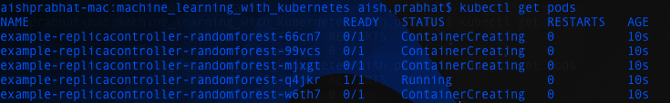
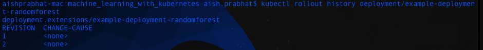

# Machine Learning with Kubernetes


## Overview

### What this tutorial covers:
1. Kubernetes Overview
	- Mapping from Docker Compose to Kubernetes
	- Intro
	- Architecture
2. Pod
2. Replication controller
3. Deployment
	- Updating an image in a deployment
4. Labels
5. Healthcheks
	- Liveness Probe
	- Readiness Probe
	- Startup Probe

-----
5. Services 
	- NodePort
	- ClusterIP
	- Loadbalancer
	- Ingress
	- Service Discovery
5. Volumes
7. ConfigMap
8. Namespaces
8. StatefulSets
9. DaemonSets
10. Autoscaling
12. Affinity

----
10. Resource Usage monitoring
13. Taints and tolerations
14. Custom resource definitions
15. Operators
16. Resource Quotas
18. User Management + RBAC
19. Node maintenance
20. High availability
21. Helm + Helm charts

---

## What is Kubernetes?
- Open source orchestration system for containers
- Lets you schedule containers on a cluster of machines
- You can run multiple containers on one machine
- You can run long running services
- Kubernetes will manage the state of these containers
	- Can start the container on specific nodes
	- Will restart a container when it gets killed
	- Can move containers from one node to another
-  Instead of running containers manually, kubernetes is a platform that will manage the containers for you
-  Kubernetes clusters can start with one node and be scaled to thousands of nodes
-  'Competitors': docker swarm, mesos

### Mapping from Docker Compose to Kubernetes


### Kubernetes Architecture


- Master Node: responsible for the overall management of the Kubernetes cluster
- API Server: allows users and objects in Kubernetes to talk to the K8s API. It is the 'front-end' of the K8s control plane
- Scheduler: watches for newly created Pods that have no Node assigned. For every Pod that the scheduler discovers, the scheduler becomes responsible for finding the best Node for that Pod to run on
- Controller Manager: runs controllers. Controllers are background threads whose main duty is to react to changes to the cluster's desired state and actual state to do whatever you can to update the latter so that it matches the former
- etcd: distributed key-value store that acts as K8s' database. Some examples of the info stored are: scheduling information, pod state information etc
- kubectl: CLI for users to interact with the cluster through the API server. It has a kubeconfig file that holds onto authentication information etc.


- Worker Node: nodes where applications operate. Can be a physical server or VM
- kubelet: handles communication between the worker node and master node via the api server, checks if pods have been assigned to its corresponding node, executes pod containers using the container engine, mounts and runs pod volumes and secrets. It is aware of pod and node states and responds back to the master
- docker: container engine running on the worker nodes
- kube-proxy: handles routing for packets and performs connection forwarding. Worker nodes are exposed to connections from the 'outside world' through the kube-proxy (via a loadbalancer)


### Minikube

Another way of looking at the overall architecture:

Lightweight Kubernetes implementation that creates a VM on your local machine and deploys a simple cluster containing only one node. Follow instructions for here for [installation](https://kubernetes.io/docs/tasks/tools/install-minikube/)


## Pod

### What is a pod?
- A pod is a smallest unit object in K8s. 
- It is a grouping of containers with a common purpose. 
- In K8s we don't deal with one naked single container by itself. 
- The smallest thing we can deploy is a pod. A pod must have 1 or more contianers inside of it. 
- Containers in a pod should be tightly related to each other. 

`src/pods_and_deployments/pod-randomforest.yml`

```
apiVersion: v1
kind: Pod
metadata:
    name: example-pod-randomforest
    labels:
      app: random-forest-app
spec:
  containers:
    - name: simple-randomforest
      image: aishpra/simple-randomforest
      ports:
        - containerPort: 5000
    
```

- apiVersion: scopes or limits the types of objects we can use in a given config file
- kind: type of object that is being defined in the config file, in this case a Pod
- metadata: all the information about the pod itself
	- name: tag used for kubectl and logging etc.
	- labels: refer to section on labels
- containers: the config of the containers inside the pod
	- name: is a tag used to refer to the specific container, useful for tagging and networking
	- image: the image that the container is going to be made out of
	- ports: config related to ports of the container
		- containerPort: the port of the container that will be exposed
- Then we run `kubectl apply -f src/pods_and_deployments/pod-randomforest.yml`
- Then we use port forwarding to access the pod using `kubectl port-forward example-pod-randomforest 5000:5000`
- We can kill the pod using `kubectl delete pods <pod-name>`


### Useful commands


### Debugging
For debugging purposes and understanding the lifecycle of a pod, there are three key things we need to look at:

- Pod Status: high level status. You can check status of pods by running `kubectl get pods`
- Pod condition: the condition of the pod. You can get 
- Container State: state of the container itself

#### Pod State
- Pod State == Runnning
	- The pod has been bound to a node
	- All containers have been created
	- Atleast one container is still running or is starting/restarting

- Pod State == Pending
	- Pod has been accepted but is not running
	- Happens when the container image is still downloading
	- If the pod cannot be scheduled because of resource constraints

- Pod State == Succeeded
	- All containers within the pod have been terminated successfully and will not be restarted

- Pod State == Failed
	- All containers within this pod have been terminated and atleast one container returned a failure code
	- The failure code is the exit code of the process when a container terminates

- Pod State == Unknown
	- The state of the pod couldn't be determined
	- A network error might have occurred
	- One example is if the node on whcih the pod is running is down

- Pod State == CrashLoopBackoff
	- Application inside the container keeps crashing
	- Some type of parameters of the pod or container have been configured incorrectly
	- If you have a proper CI/CD setup, it is unlikely that you will see this

- Pod State == ErrImagePull
	- K8s is unable to pull the image
	- Could be because image doesn't exist
	- Could be because right credentials for accessing a private container registry not provided as ImagePullSecrets

#### Pod Conditions
We can get pod conditions by running `kubectl describe pods <podname>`. There are 5 different types of PodConditions:

- PodScheduled: the pod has been scheduled to a node
- Ready: Pod can serve requests and is going to be added to matching services
- Initialized: the initialization containers have been started successfully
- Unschedulable: the pod cants be scheduled
- ContainersReady: all containers in the pod are ready


#### Container States
We can get container states by running `kubectl describe pods <podname>`. Can be running, terminated or waiting.


### Pod Lifecycle


- init container: carry out some tasks such as creating directories, permissions etc before starting the main container. It is a completely separate container.


- post start hook: starts with the main container, within the main container. It is, again, for doing some work before the main container starts. The probes only start after post start hook and initialDelaySeconds.


- probes: The probes only start after post start hook and initialDelaySeconds.


- pre stop hook: this hook is called immediately before a container is terminated due to an API request or management event such as liveness probe failure, preemption, resource contention and others. A call to the preStop hook fails if the container is already in terminated or completed state. prestop hooks are what you will leverage for graceful pod shutdown.

```
apiVersion: v1
kind: Pod
metadata:
  name: lifecycle-demo
spec:
  initContainers:
  - name: init
  	image: busybox
  	command: ["/bin/sh", "-c", "sleep 10"]
  containers:
  - name: lifecycle-demo-container
    image: nginx
    lifecycle:
      postStart:
        exec:
          command: ["/bin/sh", "-c", "echo Hello from the postStart handler > /usr/share/message"]
      preStop:
        exec:
          command: ["/bin/sh","-c","nginx -s quit; while killall -0 nginx; do sleep 1; done"]
```

## Replication Controller

(Recommended only if the application is stateless) 


### What is a replication controller?
- Scaling in Kubernetes can be done using the replication controller
- Replication controller will ensure a specified number of pod replicas will run at all times
- Pods created with a replica controller will automatically be replaced if they fail, get deleted or are terminated


```
apiVersion: v1
kind: ReplicationController
metadata:
  name: example-replicacontroller-randomforest
spec:
  replicas: 5
  selector:
    app: rc-randomforest 
  template:
    metadata:
      labels:
        app: rc-randomforest 
    spec:
      containers:
        - name: simple-randomforest
          image: aishpra/simple-randomforest
          ports:
          - containerPort: 5000
```

- Then we can run `kubectl apply -f src/pods_and_deployments/replicacontroller-randomforest.yml` 
- We can check the pods using `kubectl get pods`. You should see something like this:

- We can check the replicationcontroller by running `kubectl get replicationcontrollers`. You should see something like this 
- We can port-forward from one of the pods to check if the app is working
- Even if we kill one of the pods, it will be restarted using the replication controller

- We can then kill the replication controller using `kubectl delete replicationcontrollers example-replicacontroller-randomforest` .
You will see something like this when you run `kubectl get pods`:


## Deployment

### What is a deployment?
- A deployment maintains a set of identical pods, ensuring that they have the correct config and that the right number exists.
- It  continuously watches all the pods related to itself and ensures that they are in the right state
- When a change is made in the deployment config, either the pods are altered or killed and a new one created

### Deployment vs Replication Controller
- Deployments are a newer and higher level concept than Replication Controllers
- They manage the deployment of Replica Sets (also a newer concept, but pretty much equivalent to Replication Controllers), and allow for easy updating of a Replica Set as well as the ability to roll back to a previous deployment.

`src/pods_and_deployments/deployment-randomforest.yml`

```
apiVersion: apps/v1
kind: Deployment
metadata:
  name: example-deployment-randomforest
  labels:
    app: dep-randomforest
spec:
  replicas: 3
  selector:
    matchLabels:
      app: dep-randomforest
  template:
    metadata:
      labels:
        app: dep-randomforest
    spec:
      containers:
        - name: simple-randomforest
          image: aishpra/simple-randomforest
          ports:
          - containerPort: 5000
```

- apiVersion: scopes or limits the types of objects we can use in a given config file
- kind: type of object that is being defined in the config file, in this case a Deployment
- metadata: all the information about the deployment itself
- spec: specifications related tp tje deployment
	- replicas: number of identical pods to create
	- selector and labels: handles for 'connecting' deployment and pod
	- template: template of the pod

- Run `kubectl apply -f src/pods_and_deployments/deployment-randomforest.yml`
- Run `kubectl get ...` to check the state of the cluster
- We can run `kubectl port-forward deployment/example-deployment-randomforest 5000:5000` to test if the app is running
- Run `kubectl delete deployments <name-of-deployment>` to kill the deployment and associated pods


### Updating a Container Image in a Deployment (Rolling Update)

- We can update the container image using the command `kubectl set image deployment/<deployment-name> <container-name>=<new-image>`
- For this example we will run the command `kubectl set image deployment/example-deployment-randomforest simple-randomforest=aishpra/simple-randomforest:v2`. You can check the docker images used in this example [here](https://hub.docker.com/r/aishpra/simple-randomforest/tags).
- We can monitor the rolling update using `kubectl get pods -w`. You should see something like this:

- A neat trick to use to tag your Docker images is to use the SHA string corresonding to your git commit. That way there is a clear link between the pushed code and version of the image created as a consequence
- We can also run `kubectl rollout status deployment/example-deployment-randomforest` to keep track of the rolling update process. You should see something like this:

- We can also check the image running on the pods using `kubectl get pods -o jsonpath="{..image}" |tr -s '[[:space:]]' '\n' |sort |uniq -c`
- We can use `kubectl rollout history deployment/example-deployment-randomforest`. We can increase the number of revisions that kubernetes keeps by editing the specs paramaters in the deployment.yml file. You should see something like this:

- We can rollback the update by using `kubectl rollout undo deployment/example-deployment-randomforest`

(remember to run `kubectl delete deployments ...` to delete current deployment and pods to get ready for next parts of the tutorial)

### Useful commands


## Labels

- Labels are key-value pairs that can be attached to objects
- You can label your objects, for instance your deployment, to follow some sort of a structure. For example:
	- Key: environment - Value: dev/test/live
	- Key: team - Value: mt, listing, fraud
- Labels are not unique and multiple labels can be added to one object
- Once labels are attached to an object, you can use filters to narrow down results (Label Selectors)
- Using label selectors you can use matching expressions to match labels
	- eg: environment = test or live

#### NodeSelector
- You can use labels to tag nodes
- Once nodes are tagged you can use label selectors to let pods run only on specific nodes. Eg: run on fraud test servers
- To run pods on specific nodes:
	- Tag the node using `kubectl label nodes minikube project=listingqc`
	- We can run `kubectl get nodes --show-labels` to view the labels of each node
	- Add nodeSelector to your config (`src/pods_and_deployments/deployment-rf-nodeselector.yml`)
	
	```
	apiVersion: apps/v1
kind: Deployment
metadata:
  name: example-deployment-randomforest
  labels:
    app: dep-randomforest
spec:
  replicas: 3
  selector:
    matchLabels:
      app: dep-randomforest
  template:
    metadata:
      labels:
        app: dep-randomforest
    spec:
      containers:
        - name: simple-randomforest
          image: aishpra/simple-randomforest
          ports:
          - containerPort: 5000
      nodeSelector:
        project: listingqc
	```
and then we run `kubectl apply -f src/pods_and_deployments/deployment-rf-nodeselector.yml`

(remember to run `kubectl delete deployments ...` to delete current deployment and pods to get ready for next parts of the tutorial)


## Health Checks

- If your application malfunctions, the pod and container can still be running but the application may not work anymore
- To detect and resolve problems with your application, you can run health checks
- You can run 2 different types of health checks
	- Running a command in the container periodically
	- Periodic checks on a particular URL
- The typical production application behind a load balancer should always have health checks implemented in some way to ensure availability and resiliency of the app


### Liveness Probe
- Scenario: Deployment is running fine, pods are running fine, containers are running fine but the app in the container is not running fine
- The kubelet uses liveness probes to know when to restart a Container. 
- For example, liveness probes could catch a deadlock, where an application is running, but unable to make progress. Restarting a Container in such a state can help to make the application more available despite bugs.
- Another exaple: in the event that a container is accepting requests and then one particular request causes the container to crash, then kubernetes will restart the container
`src/pods_and_deployments/healthcheck-rf.yml`

```
apiVersion: apps/v1
kind: Deployment
metadata:
  name: example-deployment-randomforest-healthcheck
  labels:
    app: dep-randomforest
spec:
  replicas: 3
  selector:
    matchLabels:
      app: dep-randomforest
  template:
    metadata:
      labels:
        app: dep-randomforest
    spec:
      containers:
        - name: simple-randomforest
          image: aishpra/simple-randomforest
          ports:
          - name: flask-port
            containerPort: 5000
          livenessProbe:
            httpGet:
              path: /predict?s_length=1&s_width=2&p_length=3&p_width=4
              port: flask-port
            initialDelaySeconds: 15
            timeoutSeconds: 30
```
- We can see the configuration for this livenessProbe when we run `kubectl describe pods` and `kubectl get pods`. You should see something like this   

- If we mess up the config a bit and run `kubectl apply -f src/pods_and_deployments/healthcheck-rf.yml`

```
      containers:
        - name: simple-randomforest
          image: aishpra/simple-randomforest
          ports:
          - name: flask-port
            containerPort: 5000
          livenessProbe:
            httpGet:
              path: /predict
              port: flask-port
            initialDelaySeconds: 15
            timeoutSeconds: 30
```
- ...and then we run `kubectl describe pods` and `kubectl get pods` we'll see 


### Readiness Probe

- Scenario: Even though the livenessProbe helps to restart containers in the event of a crash, we don't yet have a way to check for such faulty containers
- Readiness Probes indicate whether the container is ready to serve requests
- If the check fails, the container will not be restarted but the Pod's IP address will be removed from the Service, so it will not serve any requests anymore
- The readiness test will make sure at startup that the pod will only receive traffic when the test succeeds

`src/pods_and_deployments/healthcheck-rf.yml`

```
apiVersion: apps/v1
kind: Deployment
metadata:
  name: example-deployment-randomforest-healthcheck
  labels:
    app: dep-randomforest
spec:
  replicas: 10
  selector:
    matchLabels:
      app: dep-randomforest
  template:
    metadata:
      labels:
        app: dep-randomforest
    spec:
      containers:
        - name: simple-randomforest
          image: aishpra/simple-randomforest
          ports:
          - name: flask-port
            containerPort: 5000
          livenessProbe:
            httpGet:
              path: /predict?s_length=1&s_width=2&p_length=3&p_width=4
              port: flask-port
            initialDelaySeconds: 15
            timeoutSeconds: 30
          readinessProbe:
            httpGet:
              path: /predict?s_length=1&s_width=2&p_length=3&p_width=4
              port: flask-port
            initialDelaySeconds: 15
            timeoutSeconds: 30

```

- We can runrun `kubectl apply -f src/pods_and_deployments/healthcheck-rf.yml` and then `kubectl get pods -w` and you should see something like this: 

(remember to run `kubectl delete deployments ...` to delete current deployment and pods to get ready for next parts of the tutorial)


### Startup Probe

- The kubelet uses startup probes to know when a Container application has started. 
- If such a probe is configured, it disables liveness and readiness checks until it succeeds, making sure those probes don’t interfere with the application startup. 
- This can be used to adopt liveness checks on slow starting containers, avoiding them getting killed by the kubelet before they are up and running.


## Services

- Sets up networking in a K8s CLuster
- There are 4 different kinds of services ClusterIP, NodePort, LoadBalancer and Ingress
- We need services because pods get deleted and updated in the nodes all the time, so services help us watch the pods which match its selector and automatically route traffic to them even though their IP adress might change during update


### NodePort

- A NodePort is an open port on every node of your cluster
- Kubernetes transparently routes incoming traffic on the NodePort to your service, even if your application is running on a different node.
- A NodePort is assigned from a pool of cluster-configured NodePort ranges (typically 30000–32767)

`src/pods_and_deployments/rf-node-port.yml`

```
apiVersion: v1
kind: Service
metadata:
  name: rf-node-port
spec:
  type: NodePort
  ports:
    - port: 3050
      targetPort: 5000
      nodePort: 31515
  selector:
    app: dep-randomforest
```

- apiVersion: scopes or limits the types of objects we can use in a given config file
- kind: type of object that is being defined in the config file, in this case a Service
- metadata: all the information about the service itself
- spec: config related to the Service
	- type: either ClusterIP, NodePort, LoadBalancer and Ingress
	- ports: config related to the ports
		- port: the port used by other pods to communicate to a specific pod
		- targetPort: connects to the port that is exposed on a pod that this service is related to
		- nodePort: exposed to the outside world. If not defined, assigned a random value.
	- selector: config related to labels of pods. It looks for a key value pair to forward traffic to


- We can run `kubectl apply -f src/pods_and_deployments/deployment-randomforest.yml` and `kubectl apply -f src/services_demo/rf-node-port.yml`
- Then we run `minikube ip` to get the IP of our minikube node
- If we go to our browser to the address `http://<minikubeip>:31515/apidocs` you will find the app working like a charm

(remember to clean up using`kubectl delete ...` to prepare for next part of the tutorial)


### ClusterIP

- A ClusterIp is what allows a group of objects to interact with one another. 
- It is like. NodePort, in that it exposes a pod/set of pods but unlike a NodePort it does not allow access from the outside world.


- We first create a Redis deployment

`src/services_demo/deployment-redis.yml`

```
apiVersion: apps/v1
kind: Deployment
metadata:
  name: redis-rf-deployment
  labels:
    app: redis-rf
spec:
  replicas: 1
  selector:
    matchLabels:
      app: redis-rf
  template:
    metadata:
      labels:
        app: redis-rf
    spec:
      containers:
        - name: redis-rf-container
          image: redis
          ports:
          - containerPort: 6379
```

- We then place a ClusterIP in front of it

`src/services_demo/clusterip-rf-redis.yml`

```
apiVersion: v1
kind: Service
metadata:
  name: redis-clusterip
spec:
  type: ClusterIP 
  selector:
    app: redis-rf
  ports:
    - port: 6379
      targetPort: 6379
```

- There is a slight change in our rf-deployment. We will use the image `aishpra/rf-redis:clusteripdemo2`
- The image's prediction script has a slight change

```
import pickle
from flask import Flask, request, jsonify
from flasgger import Swagger
import numpy as np
import pandas as pd
import redis

with open('iris_model.pkl', 'rb') as model_file:
    model = pickle.load(model_file)

app = Flask(__name__)
swagger = Swagger(app)


redis_host = "redis-clusterip"
redis_port = 6379
redis_password = ""

prediction_index = 0
```
- The redis_host is the name of the clusterip service sitting on top of the redis deployment
- We create a new nodeport on 31516 to talk to the new deployment with the label `app: dep-randomforest-redis`
- We then run `kubectl apply -f src/services_demo` to apply all the scripts
- We then go to our browser and long on to `http://192.168.99.104:31516/apidocs/#/default/get_predict` to try out the app. Note that your minikube ip address might be different. Use `minikube ip` to get the IP address.
- We can then exec into the redis pod and check if the redis server recorded the prediction `kubectl exec -it redis-rf-deployment-5997ff5b9b-srwkf -- redis-cli `. Note that your pod name will be different.

### Ingress

- Exposes a set of services to the outside world

- We will edit our `src/services_demo/clusterip-rf-redis.yml` to create clusterIPs for our rf-redis and simple rf deployments
- Why do we need ingress? You can think of it as a L7 load-balancer

```
apiVersion: v1
kind: Service
metadata:
  name: redis-clusterip
spec:
  type: ClusterIP 
  selector:
    app: redis-rf
  ports:
    - port: 6379
      targetPort: 6379
---
apiVersion: v1
kind: Service
metadata:
  name: rf-redis-clusterip
spec:
  type: ClusterIP 
  selector:
    app: dep-randomforest-redis
  ports:
    - port: 5000
      targetPort: 5000
---
apiVersion: v1
kind: Service
metadata:
  name: rf-clusterip
spec:
  type: ClusterIP 
  selector:
    app: dep-randomforest
  ports:
    - port: 5000
      targetPort: 5000
```

- We then run `kubectl apply -f src/services_demo/` to apply the changes
- We then run `kubectl apply -f src/pods_and_deployments/deployment-randomforest.yml`
- We should now have two different apps running on http://192.168.99.104:31515 (simple randomforest) and http://192.168.99.104:31516 (randomforest with redis)

- We then create and apply the ingress file `src/services_demo/ingress.yml`

```
apiVersion: extensions/v1beta1
kind: Ingress
metadata:
  name: rf-ingress-service
  annotations:
    kubernetes.io/ingress.class: nginx
    nginx.ingess.kubernetes.io/rewrite-target: /apidocs/
spec:
  rules:
    - http:
        paths:
          - path: /redis/
            backend:
              serviceName: rf-redis-clusterip
              servicePort: 5000
          - path: /simple/
            backend:
              serviceName: rf-clusterip
              servicePort: 5000
```

### Service Discovery
- DNS is a built-in service launched automatically
- The DNS service can be used within pods to find other services running on the same cluster
- Multiple containers within 1 pod don't need this service as they can contact each other directly
	- A ontainer in the same pod can connect to the port of other container directly using localhost:port
- To make DNS work, a pod will need a service definition

## Namespaces
- Namespaces allow you to create virtual clusters within the same physical cluster
- Namespaces logically segmentize your cluster
- If you are not using any namespace, you are actually using the default namespace
- Intended for multi-project environment
- The names of resources need to be unique within a namespace but not across namespaces
- You can divide resources of a Kubernetes cluster using namespaces
	- eg: ListingQC project can only use a max of 10GB, and 5 cores
- You can create namespaces using `kubectl create namespace myspace`
- You can set a default namespace to launch resources in (instead of using `kubectl -n <namespace>` all the time)

```
export CONTEXT=$(kubectl config view | awk '/current-context/{print $2}')
kubectl config set-context $CONTEXT --namespace=myspace
```
- Your corresponding deployment will look like this:

```
apiVersion: apps/v1
kind: Deployment
metadata:
  name: redis-rf-deployment
  namespace: myspace
  labels:
    app: redis-rf
```
- You can create resource limits within that namespace

```
apiVersion: v1
kind: ResourceQuota
metadata:
	name: compute-resources
	namespace: myspace
spec:
	hard:
      cpu: "1000"
      memory: 200Gi
      pods: "10"
      requests.nvidia.com/gpu: 4
```

## Secrets
- Secrets proved a way in Kubernetes to distribute credentials, keys, passwords or 'secret' data to the pods
- Examples: DB login password, CR login and password
- Secrets can be used as environment variables or as files (using volumes)

```
kubectl create secret docker-registry gcp-cred \
    --docker-server=asia.gcr.io \
    --docker-username=_json_key \
    --docker-password="$(cat gcp_key.json)" \
    --docker-email=notaish.prabhat@notshopee.com -n mynamespace
```


## ConfigMap

-  Configuraiton paramaters that are not secret can be put in a ConfigMap
-  The input is key-value pairs
-  The ConfigMap key-value pairs can be read by the app using:
	-  Environment variables
	-  COntainer commandline arguments in the Pod configuration
	-  Using volumes
- A ConfigMap can also container full configuration files. eg: a webserver config file
- This file can then be mounted using volumes where the application expects its config file
- This way you can inject configuration settings into containers without chainging the container itself

```
cat <<EOF > myconfig
database=postgres
otherparams=xyz
param.with.hierarchy=abc
EOF

kubectl create configmap app-config --from-file=myconfig
```


## Volumes


