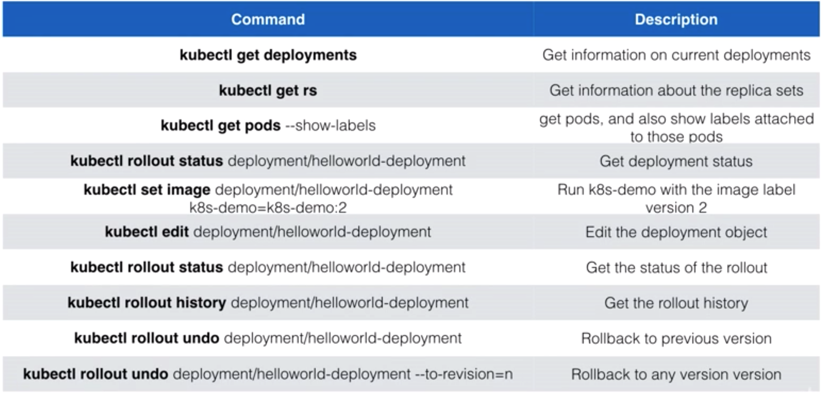

# Machine Learning with Kubernetes


## Overview

### What this tutorial covers:
1. Kubernetes Overview
	- Mapping from Docker Compose to Kubernetes
	- Intro
	- Architecture
2. Pod
2. Replication controller
3. Deployment
	- Updating an image in a deployment
4. Labels
5. Healthcheks
	- Liveness Probe
	- Readiness Probe
	- Startup Probe

-----
5. Services 
	- NodePort
	- ClusterIP
	- Loadbalancer
	- Ingress
	- Service Discovery
5. Volumes
7. ConfigMap
8. Namespaces
8. StatefulSets
9. DaemonSets
10. Autoscaling
12. Affinity

----
10. Resource Usage monitoring
13. Taints and tolerations
14. Custom resource definitions
15. Operators
16. Resource Quotas
18. User Management + RBAC
19. Node maintenance
20. High availability
21. Helm + Helm charts

---

## What is Kubernetes?
- Open source orchestration system for containers
- Lets you schedule containers on a cluster of machines
- You can run multiple containers on one machine
- You can run long running services
- Kubernetes will manage the state of these containers
	- Can start the container on specific nodes
	- Will restart a container when it gets killed
	- Can move containers from one node to another
-  Instead of running containers manually, kubernetes is a platform that will manage the containers for you
-  Kubernetes clusters can start with one node and be scaled to thousands of nodes
-  'Competitors': docker swarm, mesos

### Mapping from Docker Compose to Kubernetes


### Kubernetes Architecture


- Master Node: responsible for the overall management of the Kubernetes cluster
- API Server: allows users and objects in Kubernetes to talk to the K8s API. It is the 'front-end' of the K8s control plane
- Scheduler: watches for newly created Pods that have no Node assigned. For every Pod that the scheduler discovers, the scheduler becomes responsible for finding the best Node for that Pod to run on
- Controller Manager: runs controllers. Controllers are background threads whose main duty is to react to changes to the cluster's desired state and actual state to do whatever you can to update the latter so that it matches the former
- etcd: distributed key-value store that acts as K8s' database. Some examples of the info stored are: scheduling information, pod state information etc
- kubectl: CLI for users to interact with the cluster through the API server. It has a kubeconfig file that holds onto authentication information etc.


- Worker Node: nodes where applications operate. Can be a physical server or VM
- kubelet: handles communication between the worker node and master node via the api server, checks if pods have been assigned to its corresponding node, executes pod containers using the container engine, mounts and runs pod volumes and secrets. It is aware of pod and node states and responds back to the master
- docker: container engine running on the worker nodes
- kube-proxy: handles routing for packets and performs connection forwarding. Worker nodes are exposed to connections from the 'outside world' through the kube-proxy (via a loadbalancer)


### Minikube

Another way of looking at the overall architecture:

Lightweight Kubernetes implementation that creates a VM on your local machine and deploys a simple cluster containing only one node. Follow instructions for here for [installation](https://kubernetes.io/docs/tasks/tools/install-minikube/)


## Pod

### What is a pod?
- A pod is a smallest unit object in K8s. 
- It is a grouping of containers with a common purpose. 
- In K8s we don't deal with one naked single container by itself. 
- The smallest thing we can deploy is a pod. A pod must have 1 or more contianers inside of it. 
- Containers in a pod should be tightly related to each other. 

`src/pod-randomforest.yml`

```
apiVersion: v1
kind: Pod
metadata:
    name: example-pod-randomforest
    labels:
      app: random-forest-app
spec:
  containers:
    - name: simple-randomforest
      image: aishpra/simple-randomforest
      ports:
        - containerPort: 5000
    
```
- apiVersion: scopes or limits the types of objects we can use in a given config file
- kind: type of object that is being defined in the config file, in this case a Pod
- metadata: all the information about the pod itself
	- name: tag used for kubectl and logging etc.
	- labels: refer to section on labels
- containers: the config of the containers inside the pod
	- name: is a tag used to refer to the specific container, useful for tagging and networking
	- image: the image that the container is going to be made out of
	- ports: config related to ports of the container
		- containerPort: the port of the container that will be exposed

- Then we run `kubectl apply -f src/pod-randomforest.yml`
- Then we use port forwarding to access the pod using `kubectl port-forward example-pod-randomforest 5000:5000`
- We can kill the pod using `kubectl delete pods <pod-name>`


### Useful commands


## Replication Controller

(Recommended only if the application is stateless) 


### What is a replication controller?
- Scaling in Kubernetes can be done using the replication controller
- Replication controller will ensure a specified number of pod replicas will run at all times
- Pods created with a replica controller will automatically be replaced if they fail, get deleted or are terminated


```
apiVersion: v1
kind: ReplicationController
metadata:
  name: example-replicacontroller-randomforest
spec:
  replicas: 5
  selector:
    app: rc-randomforest 
  template:
    metadata:
      labels:
        app: rc-randomforest 
    spec:
      containers:
        - name: simple-randomforest
          image: aishpra/simple-randomforest
          ports:
          - containerPort: 5000
```

- Then we can run `kubectl apply -f src/replicacontroller-randomforest.yml` 
- We can check the pods using `kubectl get pods`. You should see something like this:

- We can check the replicationcontroller by running `kubectl get replicationcontrollers`. You should see something like this 
- We can port-forward from one of the pods to check if the app is working
- Even if we kill one of the pods, it will be restarted using the replication controller

- We can then kill the replication controller using `kubectl delete replicationcontrollers example-replicacontroller-randomforest` .
You will see something like this when you run `kubectl get pods`:


## Deployment

### What is a deployment?
- A deployment maintains a set of identical pods, ensuring that they have the correct config and that the right number exists.
- It  continuously watches all the pods related to itself and ensures that they are in the right state
- When a change is made in the deployment config, either the pods are altered or killed and a new one created

### Deployment vs Replication Controller
- Deployments are a newer and higher level concept than Replication Controllers
- They manage the deployment of Replica Sets (also a newer concept, but pretty much equivalent to Replication Controllers), and allow for easy updating of a Replica Set as well as the ability to roll back to a previous deployment.

`src/deployment-randomforest.yml`

```
apiVersion: apps/v1
kind: Deployment
metadata:
  name: example-deployment-randomforest
  labels:
    app: dep-randomforest
spec:
  replicas: 3
  selector:
    matchLabels:
      app: dep-randomforest
  template:
    metadata:
      labels:
        app: dep-randomforest
    spec:
      containers:
        - name: simple-randomforest
          image: aishpra/simple-randomforest
          ports:
          - containerPort: 5000
```

- apiVersion: scopes or limits the types of objects we can use in a given config file
- kind: type of object that is being defined in the config file, in this case a Deployment
- metadata: all the information about the deployment itself
- spec: specifications related tp tje deployment
	- replicas: number of identical pods to create
	- selector and labels: handles for 'connecting' deployment and pod
	- template: template of the pod

- Run `kubectl apply -f src/deployment-randomforest.yml`
- Run `kubectl get ...` to check the state of the cluster
- We can run `kubectl port-forward deployment/example-deployment-randomforest 5000:5000` to test if the app is running
- Run `kubectl delete deployments <name-of-deployment>` to kill the deployment and associated pods


### Updating a Container Image in a Deployment (Rolling Update)

- We can update the container image using the command `kubectl set image deployment/<deployment-name> <container-name>=<new-image>`
- For this example we will run the command `kubectl set image deployment/example-deployment-randomforest simple-randomforest=aishpra/simple-randomforest:v2`. You can check the docker images used in this example [here](https://hub.docker.com/r/aishpra/simple-randomforest/tags).
- We can monitor the rolling update using `kubectl get pods -w`. You should see something like this:

- A neat trick to use to tag your Docker images is to use the SHA string corresonding to your git commit. That way there is a clear link between the pushed code and version of the image created as a consequence
- We can also run `kubectl rollout status deployment/example-deployment-randomforest` to keep track of the rolling update process. You should see something like this:

- We can also check the image running on the pods using `kubectl get pods -o jsonpath="{..image}" |tr -s '[[:space:]]' '\n' |sort |uniq -c`
- We can use `kubectl rollout history deployment/example-deployment-randomforest`. We can increase the number of revisions that kubernetes keeps by editing the specs paramaters in the deployment.yml file. You should see something like this:

- We can rollback the update by using `kubectl rollout undo deployment/example-deployment-randomforest`

(remember to run `kubectl delete deployments ...` to delete current deployment and pods to get ready for next parts of the tutorial)

### Useful commands



## Labels

- Labels are key-value pairs that can be attached to objects
- You can label your objects, for instance your deployment, to follow some sort of a structure. For example:
	- Key: environment - Value: dev/test/live
	- Key: team - Value: mt, listing, fraud
- Labels are not unique and multiple labels can be added to one object
- Once labels are attached to an object, you can use filters to narrow down results (Label Selectors)
- Using label selectors you can use matching expressions to match labels
	- eg: environment = test or live

#### NodeSelector
- You can use labels to tag nodes
- Once nodes are tagged you can use label selectors to let pods run only on specific nodes. Eg: run on fraud test servers
- To run pods on specific nodes:
	- Tag the node using `kubectl label nodes minikube project=listingqc`
	- We can run `kubectl get nodes --show-labels` to view the labels of each node
	- Add nodeSelector to your config (`src/deployment-rf-nodeselector.yml`)
	
	```
	apiVersion: apps/v1
kind: Deployment
metadata:
  name: example-deployment-randomforest
  labels:
    app: dep-randomforest
spec:
  replicas: 3
  selector:
    matchLabels:
      app: dep-randomforest
  template:
    metadata:
      labels:
        app: dep-randomforest
    spec:
      containers:
        - name: simple-randomforest
          image: aishpra/simple-randomforest
          ports:
          - containerPort: 5000
      nodeSelector:
        project: listingqc
	```
and then we run `kubectl apply -f src/deployment-rf-nodeselector.yml`

(remember to run `kubectl delete deployments ...` to delete current deployment and pods to get ready for next parts of the tutorial)


## Health Checks

- If your application malfunctions, the pod and container can still be running but the application may not work anymore
- To detect and resolve problems with your application, you can run health checks
- You can run 2 different types of health checks
	- Running a command in the container periodically
	- Periodic checks on a particular URL
- The typical production application behind a load balancer should always have health checks implemented in some way to ensure availability and resiliency of the app


### Liveness Probe
- Scenario: Deployment is running fine, pods are running fine, containers are running fine but the app in the container is not running fine
- The kubelet uses liveness probes to know when to restart a Container. 
- For example, liveness probes could catch a deadlock, where an application is running, but unable to make progress. Restarting a Container in such a state can help to make the application more available despite bugs.
- Another exaple: in the event that a container is accepting requests and then one particular request causes the container to crash, then kubernetes will restart the container
`src/healthcheck-rf.yml`

```
apiVersion: apps/v1
kind: Deployment
metadata:
  name: example-deployment-randomforest-healthcheck
  labels:
    app: dep-randomforest
spec:
  replicas: 3
  selector:
    matchLabels:
      app: dep-randomforest
  template:
    metadata:
      labels:
        app: dep-randomforest
    spec:
      containers:
        - name: simple-randomforest
          image: aishpra/simple-randomforest
          ports:
          - name: flask-port
            containerPort: 5000
          livenessProbe:
            httpGet:
              path: /predict?s_length=1&s_width=2&p_length=3&p_width=4
              port: flask-port
            initialDelaySeconds: 15
            timeoutSeconds: 30

```
- We can see the configuration for this livenessProbe when we run `kubectl describe pods` and `kubectl get pods`. You should see something like this   

- If we mess up the config a bit and run `kubectl apply -f src/healthcheck-rf.yml`

```
      containers:
        - name: simple-randomforest
          image: aishpra/simple-randomforest
          ports:
          - name: flask-port
            containerPort: 5000
          livenessProbe:
            httpGet:
              path: /predict
              port: flask-port
            initialDelaySeconds: 15
            timeoutSeconds: 30
```
- ...and then we run `kubectl describe pods` and `kubectl get pods` we'll see 


### Readiness Probe

- Scenario: Even though the livenessProbe helps to restart containers in the event of a crash, we don't yet have a way to check for such faulty containers
- Readiness Probes indicate whether the container is ready to serve requests
- If the check fails, the container will not be restarted but the Pod's IP address will be removed from the Service, so it will not serve any requests anymore
- The readiness test will make sure at startup that the pod will only receive traffic when the test succeeds

`src/healthcheck-rf.yml`

```
apiVersion: apps/v1
kind: Deployment
metadata:
  name: example-deployment-randomforest-healthcheck
  labels:
    app: dep-randomforest
spec:
  replicas: 3
  selector:
    matchLabels:
      app: dep-randomforest
  template:
    metadata:
      labels:
        app: dep-randomforest
    spec:
      containers:
        - name: simple-randomforest
          image: aishpra/simple-randomforest
          ports:
          - name: flask-port
            containerPort: 5000
          livenessProbe:
            httpGet:
              path: /predict?s_length=1&s_width=2&p_length=3&p_width=4
              port: flask-port
            initialDelaySeconds: 15
            timeoutSeconds: 30
          readinessProbe:
            httpGet:
              path: /predict?s_length=1&s_width=2&p_length=3&p_width=4
              port: flask-port
            initialDelaySeconds: 15
            timeoutSeconds: 30

```

- We can runrun `kubectl apply -f src/healthcheck-rf.yml` and then `kubectl get pods -w` and you should see something like this: 

(remember to run `kubectl delete deployments ...` to delete current deployment and pods to get ready for next parts of the tutorial)


### Startup Probe

- The kubelet uses startup probes to know when a Container application has started. 
- If such a probe is configured, it disables liveness and readiness checks until it succeeds, making sure those probes don’t interfere with the application startup. 
- This can be used to adopt liveness checks on slow starting containers, avoiding them getting killed by the kubelet before they are up and running.


